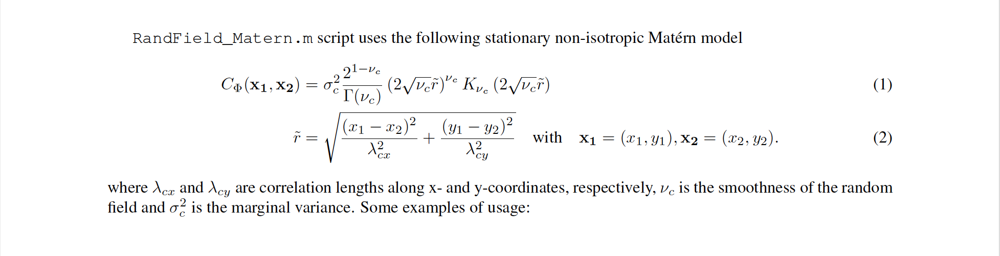
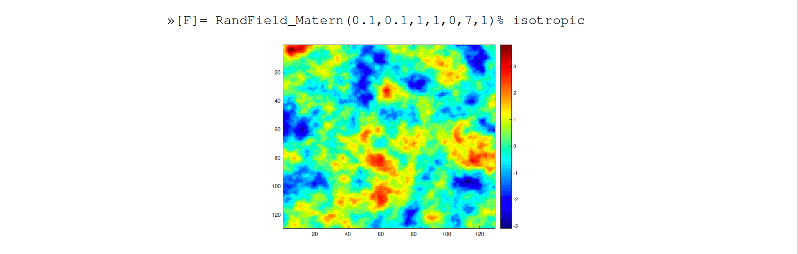
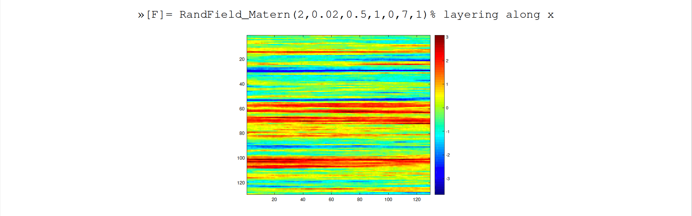
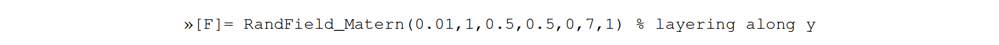
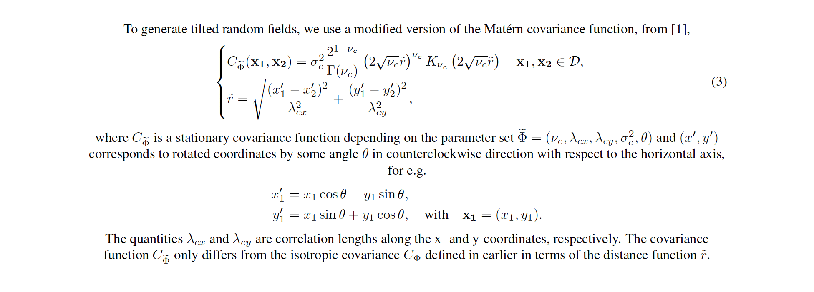
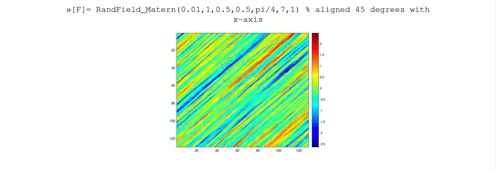
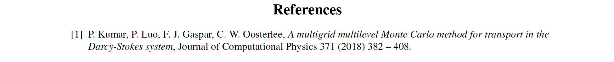
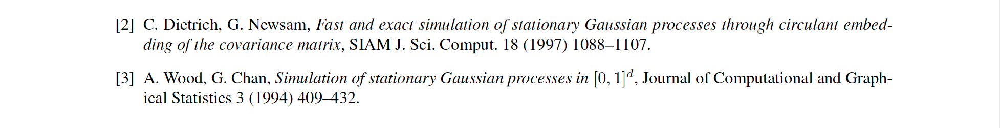

# Gaussian-random-fields
Matlab script to generate (isotropic / non-isotropic/ anisotropic ) gaussian random fields with Matern covariance parametrization. 
The covariance matrix is factorised using circulant embedding. 

